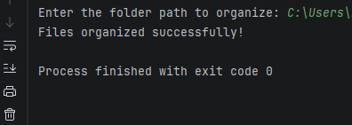

# Python File Organizer

A Python automation script that organizes files in a folder into categories such as Images, Documents, Videos, and Audio.

## Program Screenshot



## Features

- Automatically categorizes files by type
- Creates folders if they don't exist
- Moves files into appropriate folders
- Handles multiple common file formats

## Technologies Used

- Python
- Python 3
- os module
- shutil module

## Project Structure

```text
python-file-organizer/
├── organize_files.py
├── README.md
└── file-organizer-screenshot.png
```

## How to Run

1. Run the script in Python

```bash
python organize_files.py
```

2. Enter the folder path you want to organize.

Example:

```
C:\Users\YourName\Downloads
```

The script will automatically sort files into folders.

## Learning Objectives

This project demonstrates:

- Python file handling
- Automation scripting
- File system operations
- Organizing data programmatically

## Author

Anthony Bowser Jr  
Computer Science Student  
Southern New Hampshire University
